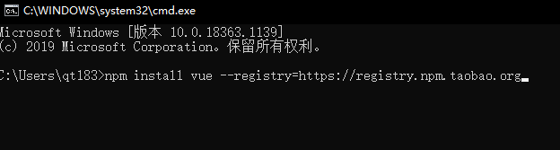
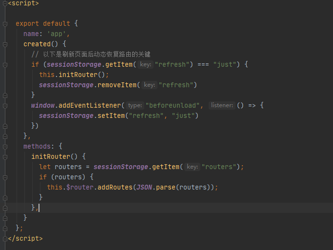
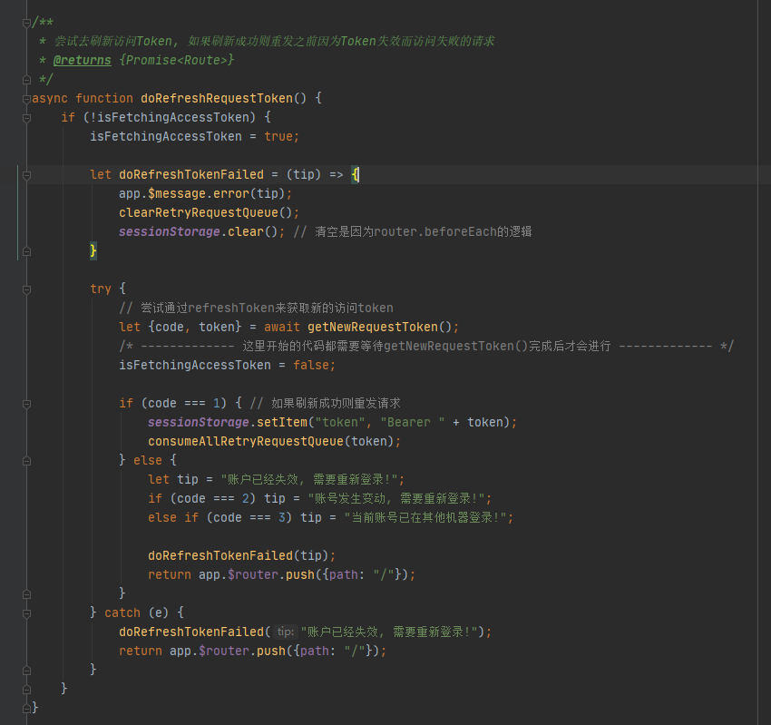
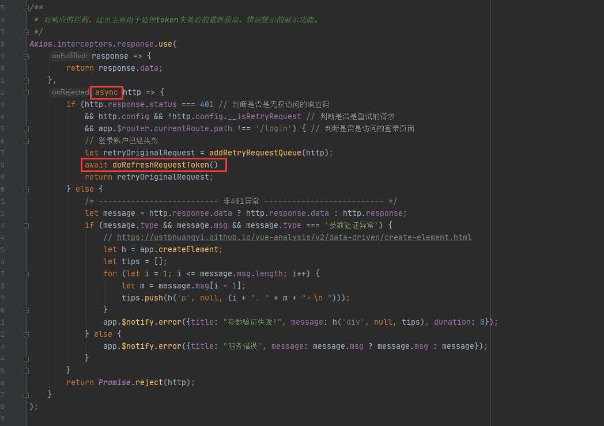
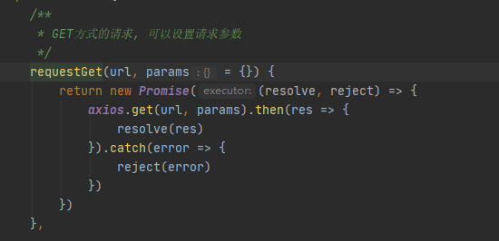
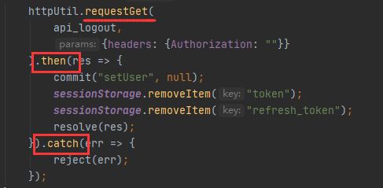

# 必读说明
## Vue 官网论坛
[官网论坛](https://forum.vuejs.org/)

## Markdown 在线阅读器
[Markdown 在线阅读器](https://www.zybuluo.com/mdeditor)

## 环境配置
1. 安装nodejs环境  
[nodejs下载地址](https://nodejs.org/en/download/)
2. 安装vue  
执行`npm install vue --registry=https://registry.npm.taobao.org`指令  

3. 安装vue-cli  
执行`npm install -g @vue/cli --registry=https://registry.npm.taobao.org`
4. 查看vue-cli版本  
执行`vue -V`，需要确保输出的版本大于等于`4.5.8`

如果已有的vue-cli版本小于`4.5.8`,升级方式如下:  
1. 进入`C:\Users\自己的用户名\AppData\Roaming\npm\node_modules\`下删除已有`@vue/cli`文件夹
2. 在控制台中执行`npm install -g @vue/cli --registry=https://registry.npm.taobao.org`

`--registry=https://registry.npm.taobao.org`的作用在于加快npm下载文件的速度

## 启动程序
1. 进入项目根目录
2. 执行`npm install --registry=https://registry.npm.taobao.org`    

3. 执行`npm run serve`
4. 通过控制台提示的地址在浏览器上直接访问

## 关于vue相关网站与github访问速度慢
可以通过在`C:\Windows\System32\drivers\etc\hosts`文件中添加一下代码加快访问速度
```
192.30.255.112 github.com
162.243.166.170 vuex.vuejs.org
```

## 关于npm install命令
`npm install`命令会将项目依赖的所有包文件下载，类似于Maven技术使用的`mvn packge`  
可以使用`npm install --registry=https://registry.npm.taobao.org`替代。  

## 关于npm run命令
前往`package.json`文件查看`scripts`标签中的内容。

默认情况下  
* `npm run serve`-本地运行项目
* `npm run build`-编译项目,编译后会在dist文件夹中生成目标文件

可以通过修改`scripts`标签中的内容来修改指令的名词。

## vue的技术栈
Vuex
Vue Router
Vue Cli
Eslint
Babel
Webpack

# 纯净项目目录结构
```
│  .editorconfig                编译器代码规范配置
│  .gitignore					标记git要忽略的文件
│  babel.config.js
│  package-lock.json			忽视，不要对该文件进行任何修改
│  package.json					项目的包管理以及环境设置(包含eslint、browserslist、scripts等配置信息)
│  
├─public                        存放项目的素材
│      favicon.ico				vue的图标，用于浏览器标签栏显示
│      index.html				vue项目的主要页面，不是关注目标，vue项目在编译后仅剩一个html文件，也就是说所有的.vue代码都会被填充到该页面内。
│      
└─src
    │  App.vue 					项目的核心文件，被main.js文件调用
    │  main.js  				项目的入口，类似于Java的main方法，
    │  
    ├─assets                    存放项目的素材
    │      logo.png
    │      
    └─components                理解为项目的包存放点
            HelloWorld.vue
```

# JWT(Json web token)技术说明
JWT是一种取代常规后端服务器使用session/cookie记录用户信息的存在，通过无状态模式来节省后端开销，通过运算来取代空间使用。  

## Session & Cookie(服务端有状态)
常规Session/Cookie，用户登录后，服务端会存储用户的Session，并返回给用户一个Cookie,用户每次访问api服务时，Http都将携带该Cookie，以使后端了解当前访问者是谁，  
但用户数量多了之后，服务器需要维护大批量的Session，这将会导致服务器压力变大，需要为维护这些Session付出额外代价。  

## JWT & SessionStorage(服务端无状态)
用户登录之后，服务端会根据用户不敏感的信息加密生成2个令牌(token)，一个叫访问Token(access_token),另一个叫刷新Token(refresh_token)。  
通常情况下访问Token时效性极短，可能10分钟/20分钟就会失效，而刷新Token时效性极长，可能有个10天、个把月。  
用户每次访问api服务是，Http都将携带访问Token，服务段解密Token以获悉当前访问者是谁，仅仅是解密&比较，这样服务器不需要为维护Session而付出代价。  
当用户的访问Token失效后，将导致无权限访问资源，这时候前端就需要使用刷新Token来访问Token刷新接口来获取新的访问Token，以使程序继续运行。  

但如果基于原始的JWT设计思路，那么会存在问题，即颁发出去的Token将不再受到服务器的管理，如果用户退出，实际上也只是在用户本地删除Token，如果可以持有Token其实仍然可以访问服务端。  
当然我们可以通过其他手段来废除Token(例如数据库记录状态、缓存存储Key等)，但如果这样做，那为什么不用Session呢？

## Https 用于安全性
无论是Session还是JWT，都做不到安全，在安全性上还得使用Https来处理，以防被抓包，日如果电脑被干穿了，那当我没说。

## Session与JWT比较
* 上手使用  
Session开箱即用，框架与浏览器默认; JWT拥有相对复杂的流程，需要前后端都进行编程。
* 多系统用户共享  
Session需要配合其他技术实现; JWT相对而言就叫位简单。
* 服务端压力  
Session占用服务端内存，会造成额外维护费用; JWT仅通过计算处理，速度较快。
* 状态管理  
Session可以被服务端直接管理; JWT不受服务器管理(基于原始概念，无法达到用户登出的逻辑)
* 舒适度
我觉得JWT好一点。

更多比较百度吧，等你用过了就知道了，但小心降智！！！。。。。

## Session还是JWT?
这是一个问题。  

实际上还是看你从事的公司的习惯或个人习惯。

# 项目说明
## package.json文件内的配置
### dependencies
生产环境依赖的包  
* 在npm install 时会被安装
* 在npm build 时会被安装
* 发生修改后需要重新npm install --registry=https://registry.npm.taobao.org

### devDependencies
开发环境依赖的包  
* 在npm install 时会被安装
* 在npm build 时不会被安装
* 发生修改后需要重新npm install --registry=https://registry.npm.taobao.org

### 关于依赖的安装
假设想要安装`vuex`的依赖，可以直接前往[npm官网](https://www.npmjs.com/) ,在主页面的搜索栏输入`vuex`,  
在搜索结果中选中想要的那一项，就能看到说明,该网站不一定提供安装代码，但一定会提供该技术的文档链接。

### ESLint (代码规范与语法错误检测)
[ESLint在Vue中的使用详解](https://blog.csdn.net/IT_HLM/article/details/78776630)   
实际上代码只要写的清晰明了，简单易懂就是最好的，这项技术会导致很多错误语法的提示，甚至还为开发带来困扰，所以我一般是关闭该技术的使用的。  
在`vue.config.js`文件中通过配置`lintOnSave: false`来关闭eslint语法校验。

`.editorconfig`文件归属于`ESLint`技术，主要是对编码软件进行格式配置，以使软件能以你想要的格式来格式化代码

### Browserslist (浏览器兼容性配置)
一般配合polyfill技术使用，见后续关于Bable>polyfill的描述  

[Vue-cli4.x配置之：browserslist](https://www.cnblogs.com/ZheOneAndOnly/p/13391904.html)  
[浏览器兼容性-官方文档](https://cli.vuejs.org/zh/guide/browser-compatibility.html#browserslist)

## public 和 assets 文件的异同
* public 不被webpack管理
* assets 被webpack管理

[vue中public与assets的区别](https://www.jianshu.com/p/2754ff66b40e)

## 关于.env 相关
* .env 无论开发环境还是生产环境都会加载的配置文件
* .env.development 开发环境加载的配置文件
* .env.production 生产环境加载的配置文件

在文件内部写的内容类似C语言的`define`宏定义，示例:  
```
VUE_APP_PORT=80
VUE_APP_NAME="我的项目"
VUE_APP_ENV_TEST=true
VUE_APP_SEVER_URL=http://127.0.0.1:8080
A=B
```

在代码中可以使用`process.env.`来获取相应属性，但也提供有默认属性(举例)  
* `process.env.NODE_ENV`获取当前环境  
`npm run serve`时是`development`，`npm run build`后放到服务器上是`production`  

使用示例:  
```
在其他.js或者.vue文件中
let a = process.env.A;
```

**注意:**  
`只有以 VUE_APP_ 开头的变量会被 webpack.DefinePlugin 静态嵌入到客户端侧的包中`  
这意味着只有VUE_APP_开头的可以在自己的js或者vue文件中使用，除此之外还有2个特殊的可以在任意地方使用`NODE_ENV`和`BASE_URL`

[环境变量和模式-官方文档](https://cli.vuejs.org/zh/guide/mode-and-env.html#%E6%A8%A1%E5%BC%8F)  
[让你秒懂 Vue .env .env.development .env.production](https://blog.csdn.net/qq_28827635/article/details/106271580)

## Babel
`Babel 是一个 Javascript 转换器，它将高级的 Javascript 转换成 可以在任何浏览器中运行的 ES5 Javascript （甚至是旧的浏览器）`

通俗解释: 通常我们在vue项目中会使用es6进行开发，但为了解决低版本浏览器的兼容问题，使用babel可以将es6转换为es5    
`babel.config.js`文件归属于`Babel`技术
```
module.exports = {
    presets: [
        ["@babel/preset-env", {useBuiltIns: "entry", corejs: 3}]
    ],
    plugins: [
        "@babel/plugin-syntax-dynamic-import"
    ]
};
```
### polyfill
`["@babel/preset-env", {useBuiltIns: "entry", corejs: 3}]`这行代码是对浏览器兼容性的设置，使用的是polyfill技术，参考[浏览器兼容性-官方文档](https://cli.vuejs.org/zh/guide/browser-compatibility.html)  
```
你会发现有 package.json 文件里的 browserslist 字段 (或一个单独的 .browserslistrc 文件)，指定了项目的目标浏览器的范围。
这个值会被 @babel/preset-env 和 Autoprefixer 用来确定需要转译的 JavaScript 特性和需要添加的 CSS 浏览器前缀。
```
其中`corejs: 3`显示的指定了使用core-js@3，有些情况下不显示指定会导致控制台提醒。

使用时需要安装`core-js`依赖，同时要在main.js中引入如下包
```
import "core-js/stable";
import "regenerator-runtime/runtime";
```

在其他地方可能看到有使用`@babel/polyfill`依赖来完成polyfill配置的方式，但当前已被弃用。

### 路由懒加载
`@babel/plugin-syntax-dynamic-import`是用来控制路由懒加载的插件，参考文档[路由懒加载-官方文档](https://router.vuejs.org/zh/guide/advanced/lazy-loading.html)  
```
当打包构建应用时，JavaScript 包会变得非常大，影响页面加载。如果我们能把不同路由对应的组件分割成不同的代码块，然后当路由被访问的时候才加载对应组件，这样就更加高效了。
```
项目中动态构建的路由尚未进行测试，但login页面使用的是直接加载的方式。

使用时需要安装`@babel/plugin-syntax-dynamic-import`依赖

## 关于vue-cli配置(vue.config.js)
在vue-cli3时代，新创建的项目默认隐藏了所有的配置信息，目的是为了屏蔽项目的配置过程，让程序开发简化(类似Spring Boot)，但当需要对配置变更时，则需要进行自行添加配置。  

其内部存放有项目的配置信息，包含有代理的设置，端口的管理，构建项目的输出路径，webpack的设置等内容

例如:  
```
// vue.config.js
module.exports = {
    // 构建的生产文件的输出路径(相对路径), 默认dist
    outputDir: 'dist',
    // 静态资源目录 (js, css, img, fonts)
    assetsDir: 'assets',
    // eslint检测, 设置为true后将在编译器警告潜在的错误，但不会导致编译失败，默认是'default'
    lintOnSave: false,
    // 激活template的使用
    runtimeCompiler: true,
    // 由于vue打包过后的js是压缩加密的
    // 如果该选项为true，则出错可以知晓错误的具体位置，但会使编译后的项目变大
    // 如果为false，则出错无法得知错误的具体位置，但会使编译后的项目变小
    productionSourceMap: !process.env.VUE_APP_ENV_TEST,
    devServer: {
        port: process.env.VUE_APP_PORT,
        // 如果vue的开发环境和后端API服务器不在同一台主机上，可以通过代理配置将请求转发给后端API服务器
        proxy: {
            '/api': {
                target: process.env.VUE_APP_SEVER_URL,
                // websocket的支持
                ws: true,
                // 开启代理，在本地创建一个虚拟服务端
                changeOrigin: true,
                // 假设在页面上的的请求为 localhost:8080/api/... 则改写为 localhost:8080/...
                pathRewrite: {'^/api': ''}
            }
        }
    },
}
```

[Vue-CLI配置文档](https://cli.vuejs.org/zh/config/#vue-config-js)  
[vue-cli3 vue.config.js配置](https://www.cnblogs.com/huoan/p/10354341.html)

### 关于 webpack
`webpack是一个模块打包工具。`

浏览器只识别html、js、css等技术，而vue项目开发使用的.vue、scss、TypeScript等技术浏览器并不支持。   
而为了让浏览器识别这些东西，我们使用webpack技术将他们打包成js文件等相关的浏览器能识别的资源文件。  
        
vue默认有一套打包规则，但功能有限，为了支持更多的语言特性(例如scss、less等)，或是为了更好的打包效果(将文件关联合并，加快用户前端的访问速度)，我们通常会进行自定义配置。

[webpack 相关-官方文档](https://cli.vuejs.org/zh/guide/webpack.html#%E7%AE%80%E5%8D%95%E7%9A%84%E9%85%8D%E7%BD%AE%E6%96%B9%E5%BC%8F)

#### loader
webpack 可以使用 loader 来预处理文件。这允许你打包除 JavaScript 之外的任何静态资源。你可以使用 Node.js 来很简单地编写自己的 loader。

本项目使用的loader有如下几个  
```
vue-loader
需要的依赖: vue-loader、vue-template-compiler"
提供的效果: https://vue-loader.vuejs.org/zh/

image-webpack-loader
需要的依赖: image-webpack-loader
提供的效果: 优化、压缩图片

svg-sprite-loader
需要的依赖: svg-sprite-loader
提供的效果: 可以将多个svg像Unity中的精灵图一样多个合并为一个，来减少对服务器访问的次数优化加载速度

sass-loader
需要的依赖: sass、sass-loader
提供的效果: 加载 sass/scss 文件并将其编译为 CSS。
该loader的使用方式与以上三者不有些同，详情见vue官网 https://cli.vuejs.org/zh/guide/css.html#%E5%90%91%E9%A2%84%E5%A4%84%E7%90%86%E5%99%A8-loader-%E4%BC%A0%E9%80%92%E9%80%89%E9%A1%B9
```

想要更多loader见 [webpack官网-loaders](https://www.webpackjs.com/loaders/)

#### configureWebpack 和 chainWebpack 的区别
他们的作用相同，都是自定义 webpack 的打包配置，区别是它们修改 webpack 配置的方式不同。  
* chainWebpack 通过链式编程的形式，来修改默认的 webpack 配置  
* configureWebpack 通过操作对象的形式，来修改默认的 webpack 配置  

我不清楚，反正我只用chainWebpack，毕竟我是后端程序员 (

## Vuex
Vuex 是一个专为 Vue.js 应用程序开发的状态管理模式。它采用集中式存储管理应用的所有组件的状态，并以相应的规则保证状态以一种可预测的方式发生变化。  
你可以把它理解成一个全局都可以访问到的单例对象，里面能存放和获取值，更多说明见下面的描述。  

[vuex中文官方文档-介绍](https://vuex.vuejs.org/zh/)
[vuex中文官方文档-API文档](https://vuex.vuejs.org/zh/api/#vuex-store)

### 配置 
需要引入`vuex`依赖

    
  

本项目中见`src/store/index.js`和`main.js`

### 基础结构
```
export default {
    namespaced: true,
    state: {
        ...
    },
    getters: {
        ...
    },
    actions: {
        ...
    },
    mutations: {
        ...
    }
}
```

### state
**定义state, 类似Java中创建类属性**    

* 只能通过`mutation`修改，不能直接修改属性  
* 可以通过直接获取属性进行访问(不建议)，可以通过`getters`内的方法来访问  
示例:
```
state: {
    自定义的属性名: 值
},
```
外部文件使用示例  
```
...mapState("文件名称", {
    自定义属性名: state => state.自定义的属性名
}),
```

### getters
**定义获取方法，类似Java常用的Getter**  

* 会缓存查询结果，当在mutation中 修改 getters中的方法操作的state时，会重置缓存

内部方法定义语法: `函数名称: ({可选的默认参数}, 自己的参数) => { ... }   默认参数可选，state, getters, rootState, rootGetters`  
示例:
```
getters: {
    // 无法传递参数
    函数名称: (state) => {
        return state.自定义的属性名;
    },
    
    // 可以传递参数，这种叫做匿名函数
    函数名称: (state) => (自己的参数) => {
        return state.自定义的属性名;
    },
},
```
外部文件使用示例  
```
...mapGetters("文件名称", {
    自定义方法名: '目标函数名称'
}),

this.自定义方法名()
```

### actions
actions 类似于 mutation，而且可以包含任意异步操作

* 修改state时仍需交给mutation来处理

内部方法定义语法: `函数名称: ({ 默认参数 }, 自己的参数) => { ... }    默认参数可选，context, dispatch, commit, state, getters, rootState, rootGetters, payload?`  
示例:
```
actions: {
    函数名称: ({commit}, value) => {
        console.log(value);
        commit("mutation中的具体方法名词", 参数);
    }
},
```
外部文件使用示例  
```
第一种方法
...mapActions("文件名称", {
    自定义方法名: '目标函数名称'
}),

this.自定义方法名()

第二种方法
this.$store.dispatch('目标函数名称', 值)
```
如果你看完了之后关于axios的描述，那么第二种方法可以这么写   
`this.$store.dispatch('目标函数名称', 值).then().catch()`  
当然你方法返回的得是`Promise`对象实例才行  

### mutation
定义设置方法，类似于Java常用的Setter

* 用来修改state的值

内部方法定义语法: `函数名称: ({ 默认参数 }, 自己的参数) => { ... }    默认参数可选，state, payload?`  
示例:
```
mutation: {
    函数名称: ({state}, 自定义的参数值) => {
        state.自定义的属性名 = 自定义的参数值;
    }
}
```
外部文件使用示例  
```
第一种方式
...mapMutations("文件名称", {
   自定义方法名: '目标函数名称'
}),

this.自定义方法名()

第二种方式
this.$store.commit('目标函数名称', 值);
```

### 序列化
默认情况下，vuex中的内容在页面刷新时会重置，导致vuex管理的数据出现意想不到的问题。  
为了解决这种问题我们使用`vuex-persistedstate`依赖来解决。

在上面的配置方式的截图中，可以看到配置的方法
```
import createPersistedState from 'vuex-persistedstate';

plugins: [createPersistedState({storage: window.sessionStorage})],
```

## Vue Router
该项技术是vue创建单页面应用的核心组件。

可以去App.vue文件中看到`<router-view/>`这样一行代码，你可以理解为他就是路由页面嵌入的地方，当切换不同的路由时，这里嵌入的内容会随之变化。

[vue router-官方文档](https://router.vuejs.org/zh/)

### 配置
需要引入`vue-router`依赖

   
   

本项目中见`src/router/index.js`和`main.js`

到这里，静态路由就已经配置完成了

### 动态路由
可以跟踪本项目的登录功能来确认动态路由的实现方式。

  
  

本项目中见`src/modules/login/index.vue`和`src/common/utils/resource-util.js`

### 页面刷新导致动态路由丢失
动态路由将会面临页面刷新导致数据丢失的清空，那样会导致访问的页面空白、报错等问题，可通过查看你App.vue文件确认处理过程。

  

`routers`是早在登录时就已经存放到sessionStorage中了

### 路由拦截
这里不做具体描述，可以前往`main.js`中查看逻辑  
router.beforeEach 在路由跳转之前执行  
router.afterEach 在路由跳转之前执行  

## Axios
需要引入`axios`依赖

Axios 是一个基于 Promise 的 HTTP 库，可以类比为 JQuery 中的 ajax(),提供了get、post请求发送的方法 

[axios-官方文档](https://github.com/axios/axios)

### 配置
这玩意不需要配置，想在哪里用就在哪里直接引入就行
`import Axios from 'axios';`

**注意:**    
```
// main.js
Vue.prototype.$http = Axios;
Vue.prototype.$httpUtil = httpUtil;
```
本项目在main.js文件中对`axios`进行了vue原型定义，在任何`.vue`文件中都可以通过`this.$http`来直接使用，import都省去了  
而且本项目还配置了专门的http工具类，可以不用直接操作`axios`，通过已有的工具类来可以进行快速开发，见`src/common/utils/http-util.js`，也可以通过`this.$httpUtil`在任意`.vue`文件中使用  
本项目后端接口的都定义在`src/common/api/index.js`文件中，方便集中管理  

**注意:**  
```
// main.js
Axios.defaults.timeout = 10000; // 单位毫秒
Axios.defaults.headers.post['Content-Type'] = 'application/json'; // 定义Axios默认的Content-Type
Axios.defaults.baseURL = process.env.NODE_ENV === "production" ? "" : "/api"; // 对开发环境和生产环境进行区分，如果是开发环境则访问路径会是/api/...,由于配置了proxy，/api/..路径会被转发到后台
```
这里有一些对`Axios`的额外设置，已达到方便管理的目的。

### async 和 await
它们是axios提供的一个组合语法

示例:  
```
async function getNewRequestToken() {
    let refreshToken = sessionStorage.getItem("refresh_token");
    return await Axios.post(
        api_refreshToken,
        {"refreshRequestToken": refreshToken},
        {headers: {"Authorization": ""}}
    )
}
```
由于`Axios`是“异步操作”，但我们都知道js是单线程的，这些技术只是通过其他方式来模拟出异步的逻辑。  
这里`Axios`之前的`await`就是告诉框架，当执行到这里需要阻塞等待结果，但并不会让整个程序被卡住，随后框架会去处理其他代码。  
而方法前的`async`就是告诉框架，一旦方法执行时遇到`await`，这个方法就会被挂起，先让其他逻辑先执行，当调用使用`async`修饰的方法时必须在前面加上`await`。  
当使用方法内使用`await`，方法也必须被`async`修饰。  

换个例子再理解:  
   


在这两张图片中，可以看到`await getNewRequestToken()`方法的调用，同时注意看注释。
`await 方法名称()`之后的所有代码都将被视为异步处理，类似于如下JQuery代码  
```
$.ajax({
    success: function() {
      // 图片中方法下面的内容就代表这里的内容
    },
    error: function() {
      // 图片中catch块中的内容就代表这里的内容
    }
})
```

### Promise
`Promise`表达的也是异步的含义，作用上与`async 和 await`一样，只是写法上不同  

  
  

可以发现，案例中使用`new Promise()`包装了`axios`返回结果，这与`async 和 await`起到的效果是一样的，都是将这一过程异步化  
而调用方则可以通过`方法名称().then().catch()`来链式调用，与JQuery写法含义更加接近。
```
$.ajax({
    success: function() {
      // 图片中then内部的逻辑就代表这里的内容
    },
    error: function() {
      // 图片中catch内部的逻辑就代表这里的内容
    }
})
```
### Axios请求拦截与JWT(Json Web Token)实现
这里是前后端分离的核心点，通过拦截http请求进行额外处理已达到token的管理逻辑

我们可以在请求之前，将token加入到Http请求的Header中
```
// main.js
Axios.interceptors.request.use(config => {
    // 在Axios的请求中添加token的内容
    let token = sessionStorage.getItem('token');
    if (token && config.headers["Authorization"] === undefined) {
        config.headers['Authorization'] = token
    }
    return config
});
```

也可以在请求之后，对失败的请求进行拦截，确认失败原因(Token刷新的主要逻辑就在这里写)。  
在Vue中失败的请求是可以重发的，第一次请求与重发请求的请求的区分就在于`__isRetryRequest`这个属性。  

当用户正在访问项目时，访问token失效导致的操作中断是极其恶心的，你也不想你填了半天的表单一下废了。  
这就是刷新Token功能的意义，让用户在使用的过程中无感觉的进行token刷新，以使系统继续使用。

刷新Token的逻辑:  
1. 拦截所有因为token失效而访问失败的请求。
2. 进行一次token刷新的请求。
3. 如果刷新成功，则将拦截到的所有失败的请求重发；如果刷新失败，直接路由到登录页。

## Vue 实例选项
也就是每个.vue文件中我们常用的内容

[Vue 实例选项 - 中文官方文档](https://cn.vuejs.org/v2/api/#%E9%80%89%E9%A1%B9-%E6%95%B0%E6%8D%AE)

### 常用选项
* name  
最好定义成不同的，在调试的时候可能用得到
* data  
对象实例的内部属性，可在模板上被访问
* props  
用于接收来自父组件的数据
* computed  
将data数据经过方法处理后在模板上被使用，会缓存方法处理后的结果 [Vue中的computed](https://segmentfault.com/a/1190000020156646)
* methods  
通常意义上来说定义普通方法的地方
* watch  
监听data中属性的变化，一旦属性发生变化则触发自定义的方法
* created  
在Vue实例创建完成后被立即调用,可以简单理解为页面模板等内容加载完成后(类比不太恰当)。

更多内容可通过查阅 [文档](https://cn.vuejs.org/v2/api/#%E9%80%89%E9%A1%B9-%E6%95%B0%E6%8D%AE) 来获取。

# 其他
## Vue中的重用性
[Vue Function-based API RFC](https://zhuanlan.zhihu.com/p/68477600)